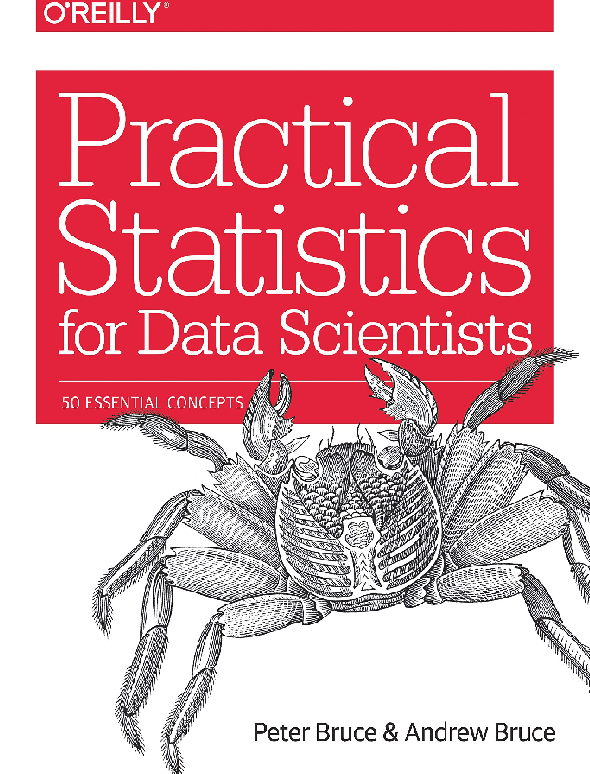

# Notas de estudo de estatística ⚠️ em andamento ⚠️

## Objetivo das notas

Estas notas fazem parte dos meus estudos sobre o livro Estatística Prática para Cientistas de Dados 1ª edição de Peter Bruce & Andrew Bruce. 
Ressalta-se que nessa obra há vários capítulos dedicados ao estudo da disciplina estatística com foco no que é amplamente utilizado no universo da ciência de dados.

Além disso, nesse repositório também há notas de estudos de outras fontes apresentando outras abordagens sobre os principais tópicos da ciência estatística.
Ressalta-se que as notas consistem em exemplos explorados com as ferramentas do ecossistema do python.

<table>
  <tbody>
    <tr valign="top">
      <td width="25%" align="center">
        Python  
        
      </td>
      <td width="25%" align="center">
        pandas  
        
      </td>
      <td width="25%" align="center">
        NumPy  
        
      </td>
      <td width="25%" align="center">
        SciPy  
        
      </td>
    </tr>
    <tr valign="top">
      <td width="25%" align="center">
        Matplotlib  
        
      </td>
      <td width="25%" align="center">
        seaborn  
        
      </td>
      <td width="25%" align="center">
        scikit-learn  
        
      </td>
      <td width="25%" align="center">
        Jupyter  
        
      </td>  
    <tr valign="top">
    <tr valign="top">
      <td width="25%" align="center">
        Statsmodels  
        
      </td>
       <td width="25%" align="center">
        Pingouin  
        
      </td>
    
  </tbody>
</table>

### Autor

Deivison Morais. Visite o meu portfólio de projetos [aqui.](https://deivison1983.github.io/portfolio_projetos/)

### Contatos

  
  

